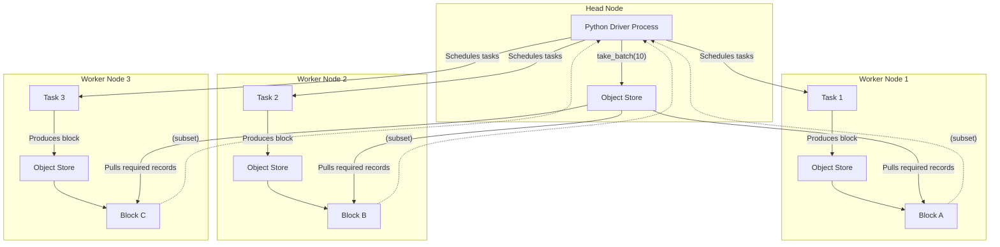

# Ray Datasets: Blocks, Object Stores, and `take_batch`

## 1. Object Stores on Each Node

- Every **Ray node** (head + workers) runs:
  - **Raylet (node manager)** → schedules tasks/actors.
  - **Plasma Object Store** → shared memory cache for objects.
- Each node has **its own object store**, sized via `--object-store-memory` or defaults.

---

## 2. Dataset Blocks

- A **Ray Dataset** is partitioned into **blocks**.
- Transformations (`map_batches`, `filter`, etc.) are executed as tasks on worker nodes.
- Each task produces **blocks stored in the local object store of that worker node**.

---

## 3. Materialization with `take_batch`

- `take_batch(n)` **triggers execution** and fetches _only `n` rows_ back to the driver (usually on the head node).
- The **blocks remain distributed** across the cluster.
- If you call `take_all` or `to_pandas`, the entire dataset is gathered into the driver process (expensive for large datasets).

---

## 4. Visual Diagram (Mermaid)

---

## 5. Key Takeaways

- **Each node has its own object store.**
- Dataset blocks live in the object store of the node that created them.
- `take_batch` pulls _only the requested records_ to the driver, not the entire dataset.
- To persist results for reuse, use `ds.persist()` (keeps blocks pinned in workers’ object stores).

---
